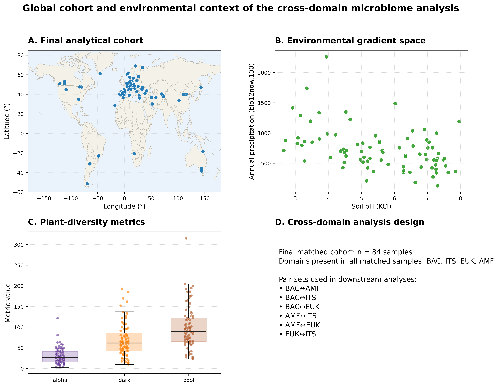
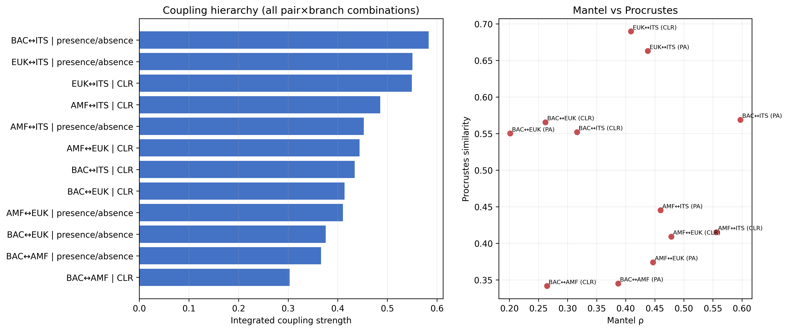
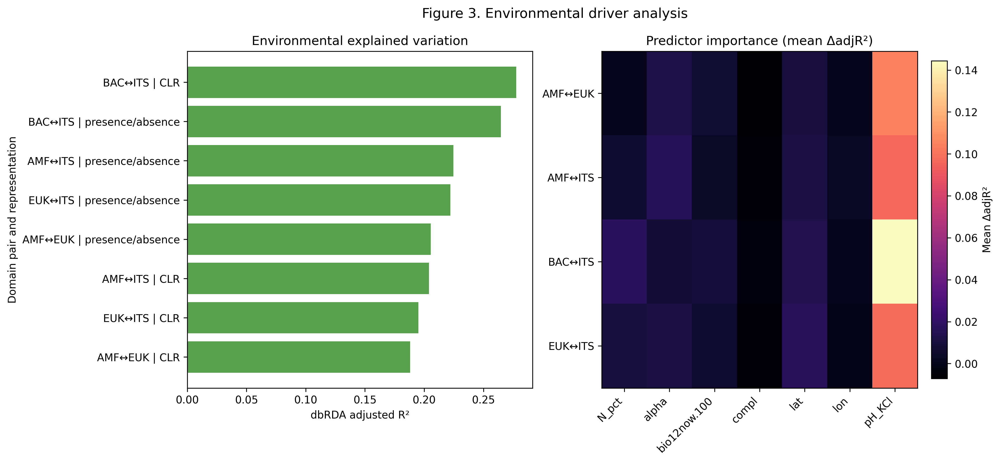
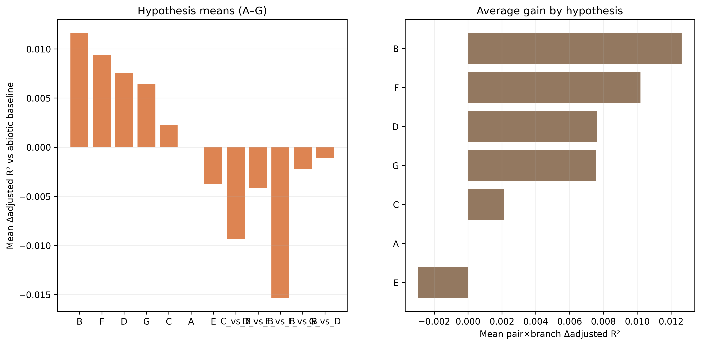
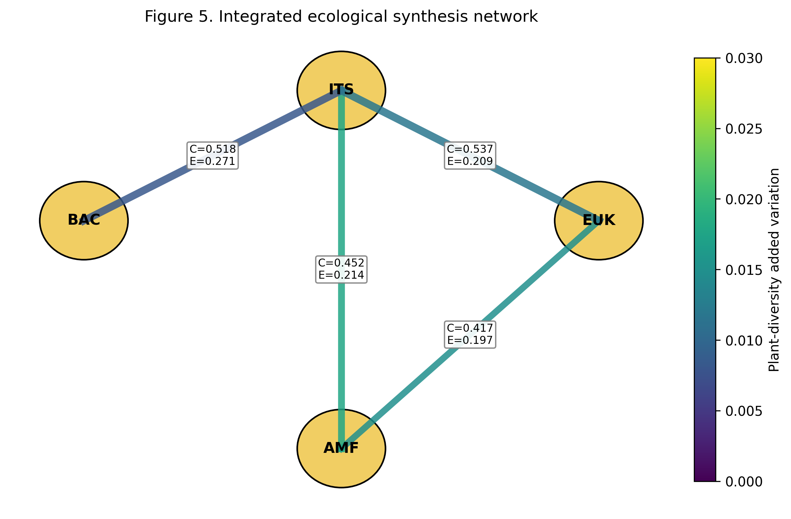

# Environmental filtering dominates cross-domain soil microbiome coupling, with secondary AMF-linked plant-context effects

## Abstract
We synthesized committed outputs for cross-domain coupling among BAC, ITS, EUK, and AMF using the final matched cohort (n=84), and integrated matrix-concordance (Mantel), geometric-alignment (Procrustes), environmental constrained-ordination (dbRDA), and plant-diversity model-comparison layers. Coupling was strongest for BAC↔ITS in presence/absence space, while AMF-linked pairs showed comparatively larger plant-context sensitivity than expected from their global coupling rank. Environmental structure was substantial across models (adjusted R² values generally around 0.19 to 0.28; p=0.001 in all dbRDA summaries), and pH repeatedly ranked as the largest predictor-level contribution. Plant-diversity increments over abiotic baselines were positive but smaller, with alpha-containing hypotheses producing the highest mean delta adjusted R². Together, the evidence supports a layered interpretation: strong cross-domain concordance, major environmental organization, and secondary plant-context modulation.

## Introduction
Soil microbial communities are assembled through interacting deterministic and stochastic processes that operate simultaneously across bacteria, fungi, and microbial eukaryotes (Luan et al., 2020; Kang et al., 2022). Deterministic processes include environmental filtering and biotic interactions, whereas stochastic processes include dispersal limitation, ecological drift, and historical contingency (Stegen et al., 2013; Ning et al., 2020). The relative importance of these mechanisms varies among microbial groups, across spatial scales, and along environmental gradients (Luan et al., 2020; Kang et al., 2022; Kayiranga et al., 2024). Consequently, concordant patterns among microbial domains can arise because different groups respond similarly to environmental conditions, because they interact directly through trophic, competitive, or metabolic relationships, or because both mechanisms operate together (Bahram et al., 2018; Jiao et al., 2022; Wang et al., 2024). Cross-domain concordance is therefore informative about ecological organization, but it does not by itself identify the mechanisms responsible for observed patterns (Deutschmann et al., 2021).

Bacteria and fungi are expected to exhibit strong cross-domain coupling because they jointly mediate decomposition, nutrient turnover, and rhizosphere processes (Waring et al., 2013; Wang and Kuzyakov, 2024). Root exudates influence bacterial community composition through substrate-specific selection, while fungal communities contribute to resource acquisition, organic matter transformation, and habitat structuring (Zhalnina et al., 2018; van der Heijden et al., 2015; Wang and Kuzyakov, 2024). These shared ecological functions could generate coordinated turnover among bacterial and fungal communities across environmental gradients. However, bacterial-fungal associations may also reflect common responses to soil conditions rather than direct interactions, emphasizing the need to distinguish ecological concordance from mechanistic dependence.

Arbuscular mycorrhizal fungi (AMF) introduce an additional ecological dimension because they directly connect plant communities with belowground microbial organization (van der Heijden et al., 2015). AMF depend on host-derived carbon and influence nutrient acquisition through extensive hyphal networks that extend beyond the root zone (Fellbaum et al., 2014; Kakouridis et al., 2024). Variation in host identity, plant functional traits, and nutrient availability can therefore alter AMF-associated microbial assemblages in ways that differ from patterns observed for free-living soil microorganisms (van der Heijden et al., 2015; Zhou et al., 2020; Wang et al., 2023). Experimental studies have shown that AM fungi can recruit distinct bacterial, fungal, and protistan communities and modify network structure within the hyphosphere (Zhou et al., 2020; Wang et al., 2023; Jin et al., 2024; Zhang et al., 2024). These observations suggest that AMF-linked microbial relationships may be particularly sensitive to plant-community context (van der Heijden et al., 2015).

Although individual microbial groups have been extensively studied, comparatively few investigations have integrated bacteria, fungi, microbial eukaryotes, and AMF within a common analytical framework. Most studies focus on a single domain or a limited set of pairwise interactions, making it difficult to evaluate whether environmental filtering and plant-community context influence different microbial domains in similar or contrasting ways. A broader cross-domain perspective is needed to determine whether observed coupling reflects shared environmental organization, plant-mediated effects, or combinations of both processes.

Environmental filtering is likely to explain an important proportion of cross-domain concordance (Bahram et al., 2018; Chemidlin Prévost-Bouré et al., 2014). Among soil variables, pH is consistently identified as one of the strongest predictors of bacterial community composition and can influence the balance between deterministic and stochastic assembly processes (Fierer and Jackson, 2006; Tripathi et al., 2018). Soil pH also affects nutrient availability, enzyme activity, and microbial physiology, creating constraints that extend across multiple microbial groups (Rousk et al., 2009; Rousk et al., 2010). Other environmental factors, including nutrient availability and climate, can further structure microbial communities and contribute to coordinated turnover among domains (Bahram et al., 2018; Oliverio et al., 2020; Shen et al., 2020). As a result, strong cross-domain coupling may often reflect shared environmental responses that are subsequently modified by biological interactions.

Plant-community context provides a complementary perspective on microbial assembly (Zhalnina et al., 2018; van der Heijden et al., 2015). Traditional diversity metrics focus on realized richness, but dark-diversity approaches extend this framework by considering taxa that are absent locally despite being members of the regional species pool (Pärtel et al., 2011; Lewis et al., 2016). Community completeness quantifies the relationship between observed diversity and the diversity that could potentially occur at a site (Pärtel et al., 2013). Together, these metrics offer a means of evaluating whether microbial community organization is associated primarily with realized plant diversity or with broader constraints related to species pools and community assembly processes (Pärtel et al., 2011; Pärtel et al., 2013). 

In this study, we evaluated soil microbial coupling across bacterial, fungal ITS, microbial eukaryote, and AMF communities using a hierarchical analytical framework. First, we quantified cross-domain coupling strength using complementary measures of community concordance. Second, we evaluated the extent to which environmental variables explained observed coupling patterns. Third, we tested whether plant-diversity metrics provided additional explanatory power beyond environmental structure alone. We hypothesized that (1) bacterial-fungal communities would exhibit the strongest overall coupling, reflecting their shared ecological functions and responses to rhizosphere processes; (2) environmental filtering, particularly soil pH, would explain a substantial fraction of cross-domain concordance; and (3) AMF-linked associations would show greater sensitivity to plant-community context than would be predicted from coupling strength alone. By integrating coupling analyses, environmental drivers, and plant-diversity effects within a single framework, this study aims to clarify how multiple ecological layers contribute to the organization of soil microbial communities.
## Methods
### 2.1 Study system and matched cohort
We analyzed a matched cross-domain soil microbiome cohort containing 84 sites with complete overlap across bacterial communities (BAC), fungal internal transcribed spacer profiles (ITS), microbial eukaryotes (EUK), and arbuscular mycorrhizal fungi (AMF). This study included 84 sites distributed across six continents within the DarkDivNet framework (Europe 54, Asia 14, North America 8, Africa 1, South America 4, and Oceania 3; Fig. 1). Plant community data and derived plant-diversity metrics were taken from Pärtel et al., based on standardized DarkDivNet vegetation surveys at each site. In that framework, each site corresponds to a 100 m² (10 × 10 m) vegetation plot embedded within a study region of approximately 300 km², defined as a circle of 20 km diameter subject to coastline and access constraints. Vegetation-side predictors included local plant richness, plant dark diversity (absent species that can potentially inhabit the study site), plant species pool size (local plant richness plus dark diversity), and plant community completeness (the percentage of local plant richness from species pool size). Local observed plant richness was recorded by experienced botanists. Dark diversity was estimated from species co-occurrence patterns within each region using 30 similar vegetation plots and dark-diversity probabilities for species absent from the focal site but present regionally. Additional details are provided in Pärtel et al. (2025).

Pairwise cross-domain analyses included BAC↔ITS, EUK↔ITS, AMF↔ITS, AMF↔EUK, BAC↔AMF, and BAC↔EUK, all evaluated on the same matched sample set. In the v26 analytical release, environmental-driver and plant-diversity layers were aligned to this same six-pair design (each in presence/absence and CLR representations), so integrated synthesis was performed across all 12 pair×representation combinations.

### 2.2 Sequencing and bioinformatics
Laboratory sequencing and initial bioinformatics processing protocols are documented in the underlying project workflow and related DarkDivNet resources and are not repeated here. The present Methods focus on downstream ecological and statistical analyses applied to the completed community matrices.

### 2.3 Community representations and prevalence filtering
To evaluate cross-domain correspondence under complementary assumptions about community structure, each domain pair was analyzed in two representations: presence/absence and centered log-ratio (CLR) transformed abundance space. Presence/absence analyses used binary community matrices with Jaccard dissimilarity and principal coordinates analysis (PCoA). CLR analyses used a pseudocount of 1×10⁻⁶, CLR transformation, and Euclidean distance (Aitchison distance), with direct pairwise distance-matrix comparison treated as the canonical workflow for cross-domain inference.

Prevalence filtering was applied before ordination and coupling analyses to reduce sensitivity to extremely rare taxa while retaining ecological signal. Primary analyses used prevalence ≥ 0.05 (taxa with non-zero occurrence in at least 5% of samples). Sensitivity analyses compared no prevalence filtering and prevalence ≥ 0.10. These threshold scenarios were propagated through coupling, environmental-driver, and plant-diversity analyses, and qualitative conclusions were stable across thresholds.

### 2.4 Cross-domain coupling analyses
Cross-domain coupling was quantified using two complementary statistics: Mantel Spearman correlation for concordance among inter-sample distance matrices and Procrustes analysis for geometric alignment between paired ordination configurations. Mantel inference used 999 permutations, and Procrustes uncertainty was summarized from 120 bootstrap replicates with percentile intervals (2.5th and 97.5th percentiles).

Because Mantel and Procrustes capture different facets of correspondence, both were reported separately and jointly through an integrated coupling score defined as the mean of Mantel correlation and Procrustes similarity. In this formulation, Mantel describes matrix-level concordance, whereas Procrustes describes alignment of multivariate spatial structure; averaging the two provides a descriptive synthesis metric and comparative integration aid when both rank-order and geometric agreement are of interest. The integrated score was used within a descriptive integration framework rather than as a formal inferential statistic.

### 2.5 Environmental-driver analyses
Environmental predictors were selected a priori to represent major abiotic gradients expected to influence microbial community assembly while maintaining a parsimonious and interpretable modeling framework. Soil pH was included because it is widely recognized as a dominant determinant of microbial community composition across multiple taxonomic groups, soil nitrogen was included as an indicator of nutrient availability, and annual precipitation was included to represent broad-scale climatic variation. Additional variables, including temperature, phosphorus availability, and other soil properties, may also influence microbial communities, but were not included here to limit model complexity and focus on a small set of ecologically interpretable predictors consistently available across all sites. Distance-based redundancy analysis (dbRDA) was fitted for each pair×representation combination at the default prevalence threshold of 0.05 with 999 permutations. Geography-sensitivity models additionally included latitude and longitude to evaluate spatially structured residual variation.

Soil carbon percentage (C_pct) was not included in models containing soil nitrogen because of strong collinearity between variables. Predictor influence was quantified using leave-one-predictor reductions (ΔR² and Δ adjusted R²), and model adequacy across predictor sets was compared using adjusted R².

### 2.6 Plant-diversity hypothesis testing
To evaluate whether plant diversity explained variation in microbial coupling beyond abiotic conditions, we compared seven a priori candidate models (A–G) against an abiotic baseline model. Model A included abiotic predictors only; model B added alpha diversity; model C added dark diversity; model D added species pool size; model E added community completeness; model F added alpha plus dark diversity; and model G added species pool plus completeness.

Plant-diversity hypotheses were structured to distinguish realized local diversity (alpha diversity), potentially recruitable absent taxa (dark diversity), regional species-pool context, and the extent to which local communities approach that pool (completeness). Because alpha diversity, dark diversity, and species pool are mathematically related, these metrics were emphasized in separate candidate formulations rather than pooled into a single maximal model. Plant-diversity comparisons used CLR-transformed inputs (pseudocount 1×10⁻⁶), 10 ordination axes, the default prevalence threshold (0.05), and 999 permutations. Incremental support for each hypothesis was quantified as Δ adjusted R² relative to the abiotic baseline.

### 2.7 Integrated synthesis
To compare ecological signal layers across pair×representation combinations, we integrated three outputs: (i) coupling magnitude from Mantel-Procrustes summaries, (ii) environmental explained variation from best-performing dbRDA formulations, and (iii) added plant-diversity variation from best non-baseline plant models. For consistent interpretation across pairings, summaries were evaluated using descriptive thresholds (coupling strength ≥0.50, environmental adjusted R² ≥0.20, and plant-diversity Δ adjusted R² ≥0.01; low-plant criterion <0.005). These thresholds were used as interpretive guides for comparative synthesis and not as replacements for permutation-based inference.

### 2.8 Statistical analyses
All inferences in this manuscript were derived from completed analysis outputs, and no analyses were rerun during manuscript preparation. Permutation-based inference used 999 permutations. Procrustes uncertainty was estimated by bootstrap resampling (120 replicates), and uncertainty intervals were summarized with percentile limits (2.5th–97.5th). Across analytical layers, effect-size comparison and ranking focused on adjusted R² and Δ adjusted R² to support consistent interpretation across differing predictor structures.

## Results
Figure 1 defines the matched cohort (n = 84), and Figures 2–5 present a connected results sequence from cross-domain coupling to environmental structure, plant-diversity effects, and final synthesis.

### 3.1 Cross-domain coupling patterns

Cross-domain coupling was strongest for BAC↔ITS in presence/absence space (coupling strength 0.583; Fig. 2). EUK↔ITS remained close behind across both representations (0.551 and 0.549), and coupling values spanned 0.303–0.583 across 12 pair×representation combinations, indicating broad but uneven synchrony among domains.

Mantel and Procrustes highlighted complementary structure rather than a single ranking. BAC↔ITS presence/absence showed the strongest distance-matrix concordance (Mantel ρ = 0.597, p = 0.001), whereas EUK↔ITS in CLR showed the highest geometric alignment (Procrustes similarity = 0.690). Together, these patterns indicate that pairings can align strongly in distance structure without being identical in ordination geometry, and vice versa.

The dominant BAC↔ITS signal remained robust under prevalence sensitivity checks (Mantel ρ = 0.597 at prevalence 0.05; 0.571 at prevalence 0.10). BAC↔AMF and BAC↔EUK combinations remained comparatively weaker than BAC↔ITS and EUK↔ITS across representations, reinforcing a non-uniform coupling hierarchy.

### 3.2 Environmental structure of coupled turnover

Environmental structure was evaluated across all six pairings and both representations (12 combinations; Fig. 3). BAC↔ITS again showed among the strongest environmental structuring (adjusted R² = 0.260 in CLR; 0.265 in presence/absence in integrated summaries), and environmental explained variation across all combinations ranged from 0.177 to 0.265 (mean 0.228).

Environmental effects were coherent across pairings: model-level permutation tests were significant across all pair×representation combinations (p = 0.001), and pH remained the dominant predictor by leave-one-predictor reductions (Δadjusted R² range 0.085–0.151 across primary models). Geography sensitivity terms remained positive where included.

### 3.3 Plant-diversity contrasts across pairings

Plant-diversity effects were modest in absolute magnitude but consistently structured (Fig. 4). Hypothesis-level summaries showed highest mean gains for alpha-containing structure (model B; mean Δadjusted R² = 0.0117), followed by combined alpha+dark (model F; 0.0094) and pool-based structure (model D; 0.0075), while completeness-only structure (model E) was negative on average.

At the pair level, best-model plant-diversity increments ranged from 0.0063 to 0.0219 in Δadjusted R². The largest gains were concentrated in AMF-linked combinations (AMF↔ITS and AMF↔EUK), whereas BAC↔EUK and BAC↔ITS remained comparatively smaller. This preserves a layered pattern in which AMF-linked pairings are more plant-responsive than their coupling rank alone would suggest (Fig. 4).

### 3.4 Integrated pattern across analytical layers

Taken together, Figures 2–5 resolve a consistent cross-layer ecological contrast. BAC↔ITS combines top-tier coupling with strong environmental structure but relatively modest plant-diversity increments. AMF-linked pairings show the complementary profile: lower coupling ranks but the largest plant-diversity responsiveness.

EUK↔ITS remains intermediate-high, retaining strong coupling with moderate environmental and plant-diversity components. Across all six pairings, the main biological pattern is stable: BAC↔ITS anchors system-level coupling and environmental organization, whereas AMF-linked relationships are most sensitive to plant-diversity variation.

## Discussion
Across Figures 1–5, the central signal is not simply that communities are coupled, but that coupling strength is strongly domain-pair dependent. BAC↔ITS repeatedly occupies the top tier across representations, indicating that bacterial–fungal turnover is the most coherent cross-domain axis in this dataset. EUK↔ITS remains intermediate, whereas AMF-linked pairings are lower in global coupling but show distinct responsiveness in the plant-context layer. This layered structure is important because it argues against a single whole-soil microbiome coupling regime; instead, different domain interfaces appear to operate under different constraint sets. This interpretation is consistent with broader cross-kingdom ecology, where multi-domain interactions are often structured around specific biological interfaces rather than uniform whole-community synchronization (Bahram et al., 2018; Scheublin et al., 2010; Emmett et al., 2021). In that context, BAC↔ITS dominance observed here is plausibly the signature of broad bacterial–saprotrophic/pathotrophic fungal co-responses to shared resource and edaphic gradients, while AMF-linked relationships may reflect tighter plant-mediated filtering windows (Chemidlin Prévost-Bouré et al., 2014; Bahram et al., 2018; Zhalnina et al., 2018; van der Heijden et al., 2015; Lahrach et al., 2024).

The environmental layer indicates substantial deterministic structure, with pH-centered predictor contributions recurring across pair-representation combinations. Together with the dbRDA profiles, this supports the interpretation that environmental filtering is not merely a background effect but a first-order organizer of cross-domain community geometry. In practical terms, shifts in abiotic context, especially pH-related chemistry, coincide with coordinated reconfiguration of between-domain composition. This pattern is aligned with broader literature showing that deterministic filtering can dominate community organization when strong environmental gradients are present, even when dispersal and biotic contingencies remain active, and it aligns with rhizosphere and soil studies reporting pH-linked compositional turnover across multiple microbial groups (Ning et al., 2020; Tripathi et al., 2018; Chemidlin Prévost-Bouré et al., 2014; Rousk et al., 2010; Bahram et al., 2018). Thus, the present results fit a conservative ecological reading: deterministic environmental sorting defines most of the large-scale cross-domain scaffold, and other influences are superimposed on that scaffold rather than replacing it.

Our environmental analyses focused on a limited set of predictors chosen to represent major edaphic and climatic gradients. Consequently, the importance of pH observed here should be interpreted relative to the other variables included in the models rather than as evidence that pH is necessarily the strongest environmental driver across all possible environmental dimensions. Future analyses incorporating broader climatic, edaphic, and anthropogenic predictors may help refine the relative contribution of additional environmental constraints.

Relative to the abiotic layer, plant-diversity increments are smaller on average, but they are consistently positive for the strongest hypotheses and non-randomly distributed across domain pairs. The key point is not large effect size; it is patterned sensitivity. AMF-linked relationships show disproportionate responsiveness to plant-diversity framing, whereas BAC↔ITS remains the strongest overall in coupling and environmental structure. This asymmetry is ecologically coherent. AMF are positioned at a direct plant-soil interface and are therefore expected to track plant composition and host-related filtering more closely than many free-living bacterial–fungal components (van der Heijden et al., 2015; Lahrach et al., 2024). Recent cross-domain and AMF-hyphosphere work supports this view, showing that AMF-associated compartments can concentrate interaction structure and resource-mediated linkages among microbial groups (Scheublin et al., 2010; Emmett et al., 2021; Zhou et al., 2020; Jin et al., 2024; Rozmoš et al., 2022; Zhang et al., 2024). Under this interpretation, plant-diversity signals in our synthesis are neither noise nor dominant drivers; they are targeted modifiers superimposed on stronger abiotic organization.

The dark-diversity/completeness framing is useful here as an interpretive bridge rather than a replacement for observed composition analyses. Completeness-oriented logic asks how much of a suitable community is realized under current local filters, which helps contextualize why coupling can be strong in some domain pairs but weaker in others even within the same sites. In other words, pair-specific coupling differences can be read as differences in realized overlap within a potentially suitable multi-domain assemblage space. Methodologically, this interpretation follows the same caution emphasized in the broader community-assembly literature: absences under suitable conditions can emerge from multiple mechanisms, including dispersal limitation, establishment constraints, and interaction-mediated exclusion (Ning et al., 2020; Tripathi et al., 2018). Our synthesis does not disentangle those mechanisms directly, but it provides a structured comparative map of where these constraints are most likely to matter for cross-domain coordination.

The results are most consistent with a deterministic-leaning assembly regime at the analyzed scale, with stochasticity and contingency still contributing to residual variation. This balance is critical: deterministic dominance in variance-structure metrics does not imply a fully predictable system, only that environmental constraints explain a substantial fraction of observed organization (Ning et al., 2020; Tripathi et al., 2018). Accordingly, the integrated coupling framework should be read as a descriptive integration layer, not as an inferential test of mechanism hierarchy. It is useful for comparing relative signal strength across coupling, environmental structuring, and plant-diversity increments, but it does not by itself identify causal pathways.

Two inference boundaries are especially important. First, correlation-based cross-domain association summaries can identify coherent covariation but cannot by themselves establish direct interactions or directionality (Deutschmann et al., 2021). Second, representation choices and prevalence thresholds can shift apparent effect magnitudes even when rank-order patterns remain stable, so robustness should be judged by convergence of qualitative conclusions rather than over-interpretation of small numeric differences (Deutschmann et al., 2021). Within those boundaries, the core story remains stable and ecologically interpretable: BAC↔ITS forms the strongest shared compositional axis, pH filtering is a dominant environmental organizer, plant-diversity effects are modest but structured, and AMF-linked pairs show disproportionate plant-responsive sensitivity. Framed this way, the synthesis supports a multi-layer view of belowground organization in which abiotic filtering sets the broad template, and biotic coupling channels domain-specific responses within that template.

## Conclusions

By integrating cross-domain coupling analyses with environmental and plant-diversity frameworks, we identified a consistent hierarchy of ecological organization across soil microbial communities. Bacterial and fungal communities exhibited the strongest overall coupling, suggesting that these groups share common responses to broad environmental gradients and potentially occupy tightly linked ecological niches within soil ecosystems. Environmental filtering, particularly variation associated with soil pH, emerged as the dominant organizing force across domain pairings, indicating that large-scale abiotic constraints provide the primary template upon which microbial community structure is assembled.

Plant-community context contributed additional explanatory power, but its influence was generally smaller than that of environmental variables. Importantly, these plant-related effects were not distributed uniformly across microbial groups. AMF-linked pairings showed disproportionately strong responsiveness to plant-diversity metrics relative to their overall coupling strength, supporting the view that arbuscular mycorrhizal fungi occupy a unique position at the interface between aboveground and belowground ecological processes.

Together, these findings support a multi-layer model of soil microbiome organization in which environmental filtering establishes the broad structure of microbial communities, while plant-community characteristics modify specific components of that structure, particularly those involving plant-associated symbionts. More broadly, this study demonstrates the value of integrating coupling, environmental, and plant-diversity perspectives within a common analytical framework. Such approaches provide a richer understanding of how multiple ecological processes interact to shape complex soil microbial assemblages across large spatial scales.
## Figure legends
Figure 1. Global cohort and environmental context of the cross-domain microbiome analysis. Global distribution of the final matched cohort (n=84), environmental gradient space (pH, bio12now.100), plant-diversity distributions, and pair-set analysis design.

Figure 2. Cross-domain coupling hierarchy. Left: rank ordering of pair-representation combinations by composite coupling strength. Right: Mantel vs Procrustes comparison for each combination.

Figure 3. Environmental driver analysis. Left: dbRDA adjusted R² across pair-representation combinations. Right: predictor-level mean delta adjusted R² rankings.

Figure 4. Plant-diversity hypothesis comparison (A-G). Left: mean delta adjusted R² versus abiotic baseline. Right: pair-level response profiles across hypotheses.

Figure 5. Integrated ecological synthesis network. Network-style integration of coupling (C), environmental structure (E), and plant-diversity increments across domain pairs.

## References
Bahram, M., Hildebrand, F., Forslund, S. K., et al. 2018. Structure and function of the global topsoil microbiome. Nature 560: 233–237. https://doi.org/10.1038/s41586-018-0386-6
Chemidlin Prévost-Bouré, N., Dequiedt, S., Thioulouse, J., et al. 2014. Similar processes but different environmental filters for soil bacterial and fungal community composition turnover on a broad spatial scale. PLoS ONE 9(11): e111667. https://doi.org/10.1371/journal.pone.0111667
Deutschmann, I. M., Lima-Mendez, G., Krabberød, A. K., et al. 2021. Disentangling environmental effects in microbial association networks. Microbiome 9: 232. https://doi.org/10.1186/s40168-021-01141-7
Fellbaum, C. R., Mensah, J. A., Cloos, A. J., et al. 2014. Fungal nutrient allocation in common mycorrhizal networks is regulated by the carbon source strength of individual host plants. New Phytologist 203(2): 646–656. https://doi.org/10.1111/nph.12827
Fierer, N., and Jackson, R. B. 2006. The diversity and biogeography of soil bacterial communities. Proceedings of the National Academy of Sciences of the United States of America 103(3): 626–631. https://doi.org/10.1073/pnas.0507535103
Geisen, S., Mitchell, E. A. D., Adl, S., et al. 2018. Soil protists: a fertile frontier in soil biology research. FEMS Microbiology Reviews 42(3): 293–323. https://doi.org/10.1093/femsre/fuy006
Jiao, S., Chu, H., Zhang, B., et al. 2022. Linking soil fungi to bacterial community assembly in arid ecosystems. iMeta 1(1): e2. https://doi.org/10.1002/imt2.2
Jin, Z., Jiang, F., Wang, L., Declerck, S., Feng, G., and Zhang, L. 2024. Arbuscular mycorrhizal fungi and Streptomyces: brothers in arms to shape the structure and function of the hyphosphere microbiome in the early stage of interaction. Microbiome. https://doi.org/10.1186/s40168-024-01811-2
Kakouridis, A., et al. 2024. Arbuscular mycorrhiza convey significant plant carbon to a diverse hyphosphere microbial food web and mineral-associated organic matter. New Phytologist. https://doi.org/10.1111/nph.19560
Kang, L., Chen, L., Zhang, D., et al. 2022. Stochastic processes regulate belowground community assembly in alpine grasslands on the Tibetan Plateau. Environmental Microbiology 24(1): 179–194. https://doi.org/10.1111/1462-2920.15827
Kayiranga, A., Isabwe, A., Yao, H., et al. 2024. Distribution patterns of soil bacteria, fungi, and protists emerge from distinct assembly processes across subcommunities. Ecology and Evolution 14(7): e11672. https://doi.org/10.1002/ece3.11672
Lewis, R. J., de Bello, F., Bennett, J. A., et al. 2016. Estimating dark diversity and species pools: an empirical assessment of two methods. Methods in Ecology and Evolution. https://doi.org/10.1111/2041-210X.12443
Luan, L., Jiang, Y., Cheng, M., et al. 2020. Organism body size structures the soil microbial and nematode community assembly at a continental and global scale. Nature Communications 11: 6406. https://doi.org/10.1038/s41467-020-20271-4
Ning, D., Yuan, M., Wu, L., et al. 2020. A quantitative framework reveals ecological drivers of grassland microbial community assembly in response to warming. Nature Communications 11: 4717. https://doi.org/10.1038/s41467-020-18560-z
Oliverio, A. M., Geisen, S., Delgado-Baquerizo, M., et al. 2020. The global-scale distributions of soil protists and their contributions to belowground systems. Science Advances 6(4): eaax8787. https://doi.org/10.1126/sciadv.aax8787
Pärtel, M., Szava-Kovats, R., and Zobel, M. 2011. Dark diversity: shedding light on absent species. Trends in Ecology & Evolution 26(3): 124–128.
Pärtel, M., Szava-Kovats, R., and Zobel, M. 2013. Community completeness: linking local and dark diversity within the species pool concept. Folia Geobotanica 48: 307–317.
Rousk, J., Brookes, P. C., and Bååth, E. 2009. Contrasting soil pH effects on fungal and bacterial growth suggest functional redundancy in carbon mineralization. Applied and Environmental Microbiology 75(6): 1589–1596. https://doi.org/10.1128/AEM.02775-08
Rousk, J., Bååth, E., Brookes, P. C., et al. 2010. Soil bacterial and fungal communities across a pH gradient in an arable soil. The ISME Journal 4(10): 1340–1351. https://doi.org/10.1038/ismej.2010.58
Shen, C., Gunina, A., Luo, Y., et al. 2020. Contrasting patterns and drivers of soil bacterial and fungal diversity across a mountain gradient. Environmental Microbiology 22(8): 3287–3301. https://doi.org/10.1111/1462-2920.15090
Stegen, J. C., Lin, X., Fredrickson, J. K., et al. 2013. Quantifying community assembly processes and identifying features that impose them. The ISME Journal 7: 2069–2079. https://doi.org/10.1038/ismej.2013.93
Tripathi, B. M., Stegen, J. C., Kim, M., et al. 2018. Soil pH mediates the balance between stochastic and deterministic assembly of bacteria. The ISME Journal 12(4): 1072–1083. https://doi.org/10.1038/s41396-018-0082-4
van der Heijden, M. G. A., Martin, F. M., Selosse, M.-A., and Sanders, I. R. 2015. Mycorrhizal ecology and evolution: the past, the present, and the future. New Phytologist 205(4): 1406–1423. https://doi.org/10.1111/nph.13288
Wang, B., Chen, C., Xiao, Y.-M., et al. 2024. Trophic relationships between protists and bacteria and fungi drive the biogeography of rhizosphere soil microbial community and impact plant physiological and ecological functions. Microbiological Research 280: 127603. https://doi.org/10.1016/j.micres.2024.127603
Wang, C., and Kuzyakov, Y. 2024. Mechanisms and implications of bacterial-fungal competition for organic carbon in soils. The ISME Journal 18: wrae073. https://doi.org/10.1093/ismejo/wrae073
Wang, L., Zhang, L., George, T. S., et al. 2023. A core microbiome in the hyphosphere of arbuscular mycorrhizal fungi has functional significance in organic phosphorus mineralization. New Phytologist 238: 859–873. https://doi.org/10.1111/nph.18642
Waring, B. G., Averill, C., and Hawkes, C. V. 2013. Differences in fungal and bacterial physiology alter soil carbon and nitrogen cycling: insights from meta-analysis and theoretical models. Ecology Letters 16(7): 887–894. https://doi.org/10.1111/ele.12125
Zhalnina, K., Louie, K. B., Hao, Z., et al. 2018. Dynamic root exudate chemistry and microbial substrate preferences drive patterns in rhizosphere microbial community assembly. Nature Microbiology 3: 470–480. https://doi.org/10.1038/s41564-018-0129-3
Zhang, C., et al. 2024. Specialized protist communities on mycorrhizal fungal hyphae. Mycorrhiza. https://doi.org/10.1007/s00572-024-01167-3
Zhang, L., Zhou, J., George, T. S., Limpens, E., and Feng, G. 2022. Arbuscular mycorrhizal fungi conducting the hyphosphere bacterial orchestra. Trends in Plant Science 27(4): 402–411. https://doi.org/10.1016/j.tplants.2021.10.008
Zhou, J., Chai, X., Zhang, L., George, T. S., Wang, F., and Feng, G. 2020. Different arbuscular mycorrhizal fungi cocolonizing on a single plant root system recruit distinct microbiomes. mSystems 5(6): e00929-20. https://doi.org/10.1128/mSystems.00929-20
Emmett, B. D., Lévesque-Tremblay, V., & Harrison, M. J. (2021). Conserved and reproducible bacterial communities associate with extraradical hyphae of arbuscular mycorrhizal fungi. The ISME Journal, 15(8), 2276–2288. DOI: https://doi.org/10.1038/s41396-021-00920-2 [7]
Lahrach, Z., Legeay, J., Ahmed, B., et al. (2024). The composition of the arbuscular mycorrhizal fungal bacteriome is species dependent. Environmental Microbiome, 19, 77. DOI: https://doi.org/10.1186/s40793-024-00623-z [9]
Rozmoš, M., Bukovská, P., Hršelová, H., Kotianová, M., Dudáš, M., Gančarčíková, K., et al. (2022). Organic nitrogen utilisation by an arbuscular mycorrhizal fungus is mediated by specific soil bacteria and a protist. The ISME Journal, 16, 676–685. DOI: https://doi.org/10.1038/s41396-021-01112-8 [12]
Scheublin, T. R., Sanders, I. R., Keel, C., & van der Meer, J. R. (2010). Characterisation of microbial communities colonising the hyphal surfaces of arbuscular mycorrhizal fungi. The ISME Journal, 4, 752–763. DOI: https://doi.org/10.1038/ismej.2010.5 [13]
Zhang, C., van der Heijden, M. G. A., Dodds, B. K., Nguyen, T. B., Spooren, J., Valzano-Held, A., Cosme, M., et al. (2024). A tripartite bacterial-fungal-plant symbiosis in the mycorrhiza-shaped microbiome drives plant growth and mycorrhization. Microbiome, 12, 13. DOI: https://doi.org/10.1186/s40168-023-01726-4 [17]
